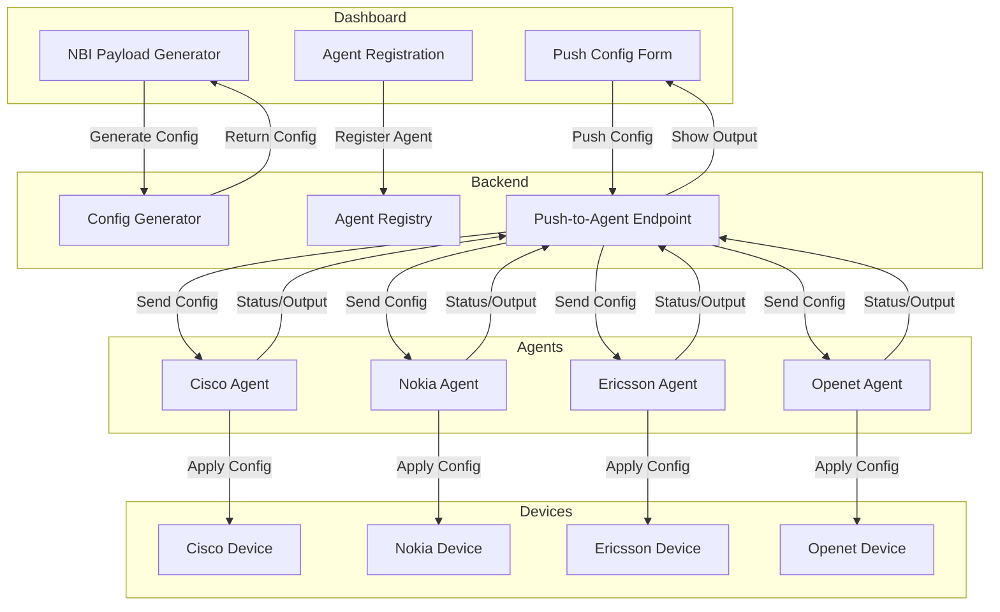
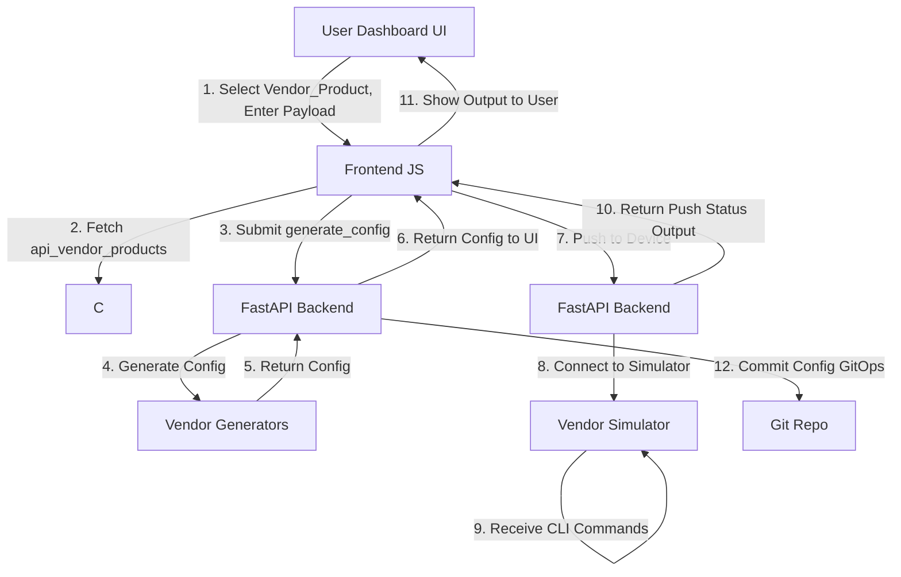

# AI-Powered Multi-Vendor Network Configuration Manager

## Overview

This project is a production-ready, extensible, multi-vendor network configuration manager and simulator. It enables network engineers and operators to dynamically generate, version, test, and push device configurations for a wide range of vendors (Cisco, Nokia, Ericsson, Huawei, Openet, and more) through a modern web dashboard.

- **Backend:** FastAPI (Python)
- **Frontend:** Jinja2 templates, HTML/CSS/JS
- **Simulators:** Local Python socket servers for each vendor/product
- **Config Storage:** GitOps (versioned, rollback, commit history)

---

## Agentic AI Device Connectors

The Agentic AI Device Connectors module provides a robust, extensible E2E workflow for multi-vendor network configuration management, bridging the gap between northbound intent (NBI) and southbound device configuration (SBI) via agent microservices for each vendor.

### What It Does
- Lets you register and manage agent endpoints for each supported vendor (Cisco, Nokia, Ericsson, Huawei, Openet, etc.).
- Provides a built-in NBI Payload Generator to create NB API payloads and generate vendor-specific configs.
- Enables direct push of generated configs to physical or simulated hardware via agents, supporting SSH, NETCONF, or other protocols.
- Supports E2E testing, demo, and production workflows from the dashboard.

### Agentic AI Workflow Diagram



### Features & E2E Flow

- **NBI Payload Generator:**
  - Compose NB API payloads (JSON) for any vendor/product.
  - Generate vendor-specific CLI/JSON/XML/YANG configs instantly.
  - Copy generated config directly to the push form.

- **Agent Registration:**
  - Register agent endpoints (IP/port, token) for each vendor.
  - View agent status, last sync, and manage endpoints.

- **Config Push:**
  - Select vendor, paste/generated config, and push directly to the device via the registered agent.
  - Supports real hardware or simulators for safe E2E testing.

- **Agent Microservices:**
  - Each vendor agent runs as a microservice (FastAPI/Uvicorn, Docker-ready).
  - Agents connect to devices via SSH, NETCONF, or other protocols.
  - Agents return status/output to the dashboard for full visibility.

- **E2E Orchestration:**
  - From NBI intent to device config, the workflow is fully automated, observable, and extensible.
  - Supports demo, development, and production deployments.

---

## Example Screenshots

> _Replace the image URLs below with actual screenshots from your deployment._

**Dashboard - NBI Payload Generator and Agentic Push**

)

**Agent Registration and Status Table**

)

---

## More Deployment Instructions

### 1. Docker Compose (Recommended)

- Build and start all services (orchestrator and agents):
  ```bash
  docker-compose up --build
  ```
- Visit [http://localhost:8000](http://localhost:8000) for the dashboard.
- Agents will be available on ports 5001 (Nokia), 5003 (Cisco), 5004 (Ericsson), 5005 (Openet).

### 2. Standalone (Dev/Test)

- Install dependencies:
  ```bash
  pip install -r requirements.txt
  ```
- Start the orchestrator:
  ```bash
  uvicorn app.main:app --host 0.0.0.0 --port 8000 --workers 4
  ```
- Start agents (in separate terminals):
  ```bash
  python agents/agent_cisco_ssh.py
  python agents/agent_nokia_ssh.py
  # ...etc.
  ```

### 3. Production Best Practices
- Use HTTPS and secure credentials.
- Protect dashboard and API with authentication.
- Use Docker or Kubernetes for orchestration.
- Monitor logs and agent health.

---

## API Endpoint Documentation

### Orchestrator API

- `GET /api/vendor-products` — List available vendor/product pairs
- `POST /generate-config` — Generate vendor-specific config from NB API payload
- `POST /api/agents/register` — Register a new agent endpoint
- `GET /api/agents/list` — List all registered agents
- `POST /api/agents/push` — Push config to a registered agent

### Agent API (per vendor)

- `POST /push-config` — Receive and apply config to device (SSH, NETCONF, etc.)
  - Example payload:
    ```json
    {
      "config": "<CLI or XML config>",
      "token": "<optional>"
    }
    ```

---

## Docker Compose Quickstart

```bash
git clone https://github.com/aamir-kode-1c/network-config-ai.git
cd network-config-ai
docker-compose up --build
```
- Visit [http://localhost:8000](http://localhost:8000) to use the dashboard.
- Agents are available on their respective ports.

---

## Developers

 Syed Aamir

---

## Key Features

- **Dynamic Vendor/Product Selection:** Supports multiple vendors and products with automatic dropdown population.
- **Config Generation:** Accepts NB API payload (JSON) and generates vendor/product-specific CLI, JSON, XML, or YANG configs.
- **Simulation & E2E Testing:** Pushes generated configs to local simulators for each vendor/product via SSH/CLI or NETCONF.
- **Version Control:** GitOps integration for config history, rollback, and audit.
- **User Feedback:** Modern dashboard with clear status, loading, and error messages.

---

## System Architecture & Workflow

