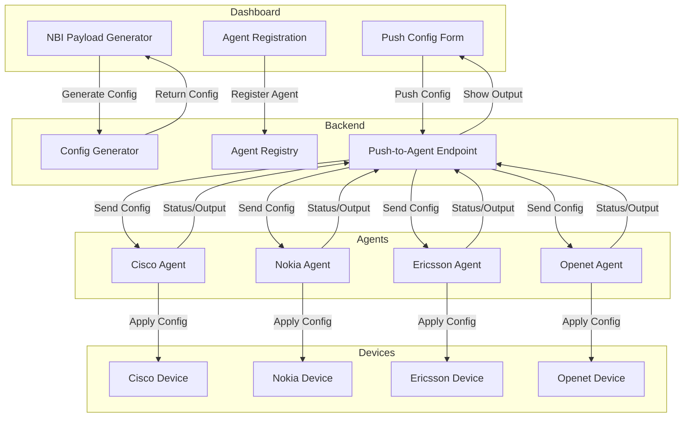
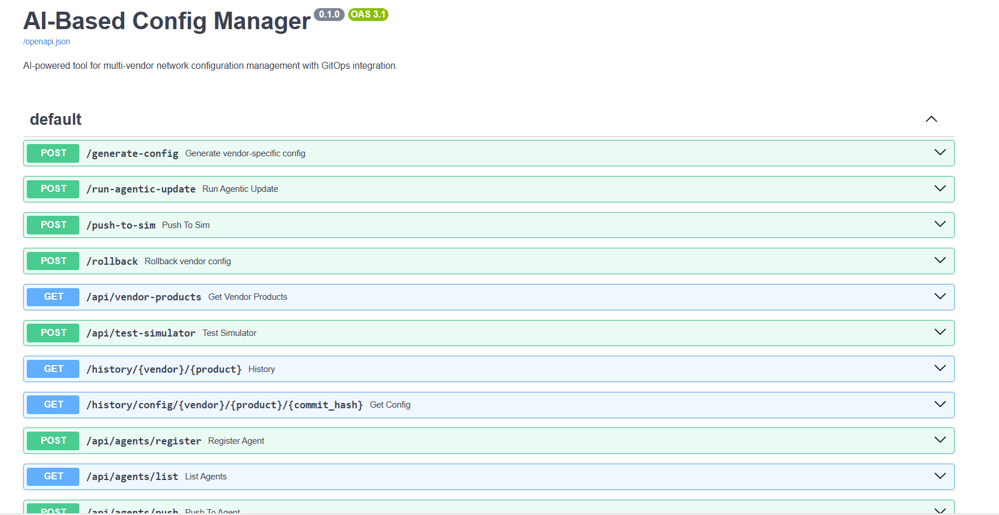
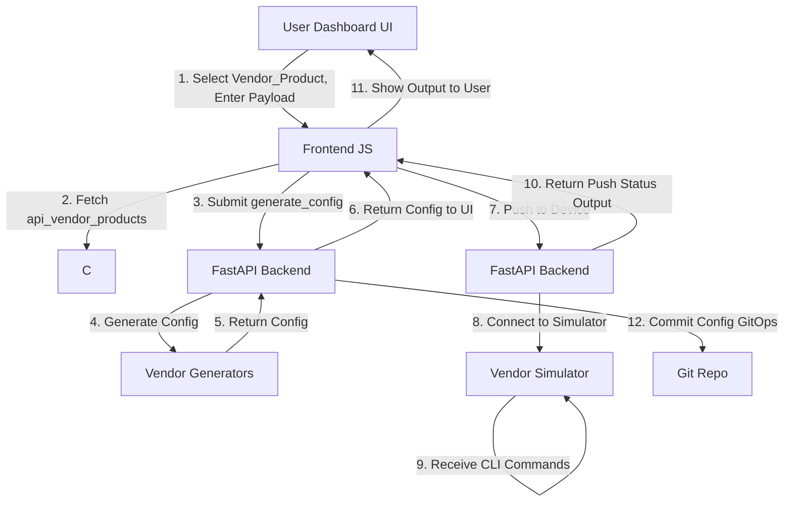

# AI-Powered Multi-Vendor Network Configuration Manager

## Overview

This project is a production-ready, extensible, multi-vendor network configuration manager and simulator. It enables network engineers and operators to dynamically generate, version, test, and push device configurations for a wide range of vendors (Cisco, Nokia, Ericsson, Huawei, Openet, and more) through a modern web dashboard.

- **Backend:** FastAPI (Python)
- **Frontend:** Jinja2 templates, HTML/CSS/JS
- **Simulators:** Local Python socket servers for each vendor/product
- **Config Storage:** GitOps (versioned, rollback, commit history)

---

## Agentic AI Device Connectors

The Agentic AI Device Connectors module provides a robust, extensible E2E workflow for multi-vendor network configuration management, bridging the gap between northbound intent (NBI) and southbound device configuration (SBI) via agent microservices for each vendor.

### What It Does
- Lets you register and manage agent endpoints for each supported vendor (Cisco, Nokia, Ericsson, Huawei, Openet, etc.).
- Provides a built-in NBI Payload Generator to create NB API payloads and generate vendor-specific configs.
- Enables direct push of generated configs to physical or simulated hardware via agents, supporting SSH, NETCONF, or other protocols.
- Supports E2E testing, demo, and production workflows from the dashboard.

### Agentic AI Workflow Diagram


```mermaid
graph TD
    subgraph Dashboard
        A[NBI Payload Generator]
        B[Agent Registration]
        C[Push Config Form]
    end
    subgraph Backend
        D[Config Generator]
        E[Agent Registry]
        F[Push-to-Agent Endpoint]
    end
    subgraph Agents
        G[Cisco Agent]
        H[Nokia Agent]
        I[Ericsson Agent]
        J[Openet Agent]
    end
    subgraph Devices
        K[Cisco Device]
        L[Nokia Device]
        M[Ericsson Device]
        N[Openet Device]
    end

    A-->|Generate Config|D
    B-->|Register Agent|E
    C-->|Push Config|F
    D-->|Return Config|A
    F-->|Send Config|G
    F-->|Send Config|H
    F-->|Send Config|I
    F-->|Send Config|J
    G-->|Apply Config|K
    H-->|Apply Config|L
    I-->|Apply Config|M
    J-->|Apply Config|N
    G-->|Status/Output|F
    H-->|Status/Output|F
    I-->|Status/Output|F
    J-->|Status/Output|F
    F-->|Show Output|C
```

### Features & E2E Flow

- **NBI Payload Generator:**
  - Compose NB API payloads (JSON) for any vendor/product.
  - Generate vendor-specific CLI/JSON/XML/YANG configs instantly.
  - Copy generated config directly to the push form.

- **Agent Registration:**
  - Register agent endpoints (IP/port, token) for each vendor.
  - View agent status, last sync, and manage endpoints.

- **Config Push:**
  - Select vendor, paste/generated config, and push directly to the device via the registered agent.
  - Supports real hardware or simulators for safe E2E testing.

- **Agent Microservices:**
  - Each vendor agent runs as a microservice (FastAPI/Uvicorn, Docker-ready).
  - Agents connect to devices via SSH, NETCONF, or other protocols.
  - Agents return status/output to the dashboard for full visibility.

- **E2E Orchestration:**
  - From NBI intent to device config, the workflow is fully automated, observable, and extensible.
  - Supports demo, development, and production deployments.

---

## Example Screenshots

> _Replace the image URLs below with actual screenshots from your deployment._

**Dashboard - NBI Payload Generator and Agentic Push**

)

**Agent Registration and Status Table**

)

---

## More Deployment Instructions

### 1. Docker Compose (Recommended)

- Build and start all services (orchestrator and agents):
  ```bash
  docker-compose up --build
  ```
- Visit [http://localhost:8000](http://localhost:8000) for the dashboard.
- Agents will be available on ports 5001 (Nokia), 5003 (Cisco), 5004 (Ericsson), 5005 (Openet).

### 2. Standalone (Dev/Test)

- Install dependencies:
  ```bash
  pip install -r requirements.txt
  ```
- Start the orchestrator:
  ```bash
  uvicorn app.main:app --host 0.0.0.0 --port 8000 --workers 4
  ```
- Start agents (in separate terminals):
  ```bash
  python agents/agent_cisco_ssh.py
  python agents/agent_nokia_ssh.py
  # ...etc.
  ```

### 3. Production Best Practices
- Use HTTPS and secure credentials.
- Configure `CONFIG_MANAGER_API_KEYS` before using `/api/v1` (the production API
  fails closed when no key is configured). The value is JSON mapping an API key
  to an actor and role, for example
  `{"replace-me":{"actor":"operator@example.com","role":"operator"}}`.
  Supported roles are `operator`, `approver`, `deployer`, and `admin`.
- Register devices through `POST /api/v1/devices`. Only a credential environment
  variable name is stored; passwords and private keys are never persisted.
- Use the approval workflow: create a change, approve it with a different
  actor, then deploy it. Changes are persisted in SQLite and every transition
  is available from `/api/v1/changes/{id}/audit`.
- NETCONF deployment requires an XML candidate, a pinned `hostkey`, candidate
  locking/validation, and confirmed commit support. Set
  `CONFIG_MANAGER_DEPLOYMENT_MODE=netconf` only after registering the device.
- Monitor `/health/live`, `/health/ready`, and `/metrics`.
- Use Docker or Kubernetes for orchestration.
- Monitor logs and agent health.

---

## API Endpoint Documentation

### Orchestrator API

- `GET /api/vendor-products` — List available vendor/product pairs
- `POST /generate-config` — Generate vendor-specific config from NB API payload
- `POST /api/agents/register` — Register a new agent endpoint
- `GET /api/agents/list` — List all registered agents
- `POST /api/agents/push` — Push config to a registered agent

### Agent API (per vendor)

- `POST /push-config` — Receive and apply config to device (SSH, NETCONF, etc.)
  - Example payload:
    ```json
    {
      "config": "<CLI or XML config>",
      "token": "<optional>"
    }
    ```

---

## API Testing with Swagger (OpenAPI UI)

This project includes an interactive API documentation and testing tool using **Swagger UI** (powered by FastAPI/OpenAPI).

- **How to Access:**
  - When the backend is running, go to [http://localhost:8000/docs](http://localhost:8000/docs) in your browser.
- **What You Can Do:**
  - Explore all available API endpoints and their request/response schemas.
  - Try out API calls directly from the browser (no need for curl/Postman).
  - See sample payloads, required fields, and error messages in real time.
- **Why Use Swagger?**
  - Great for developers, testers, and integrators to quickly validate and experiment with the API.
  - Ensures your API is self-documenting and always up to date.




  - For advanced usage, you can also access the raw OpenAPI JSON at `/openapi.json`.
---

## Docker Compose Quickstart

```bash
git clone https://github.com/aamir-kode-1c/network-config-ai.git
cd network-config-ai
docker-compose up --build
```
- Visit [http://localhost:8000](http://localhost:8000) to use the dashboard.
- Agents are available on their respective ports.

---

## Local MCP Vendor Product Server

The repository includes a local MCP server that exposes the vendor and product
catalog used by the agents. It provides:

- `list_vendors_and_products` — list all supported vendors and products
- `get_product` — retrieve product metadata and documentation links
- `get_product_payloads` — retrieve payload templates for CLI, JSON, XML, and YANG
- `vendor-products://catalog` — complete catalog MCP resource

Install dependencies and run it from the repository root:

```bash
pip install -r requirements.txt
python -m mcp_server.vendor_products_server
```

The server uses MCP stdio transport. Example MCP client configuration:

```json
{
  "mcpServers": {
    "network-config-ai-vendors": {
      "command": "python",
      "args": ["-m", "mcp_server.vendor_products_server"],
      "cwd": "C:/path/to/network-config-ai"
    }
  }
}
```

To load products from a normalized JSON catalog API instead of
`vendor_products.json`, set `VENDOR_CATALOG_URL` in the MCP client's environment:

```json
{
  "env": {
    "VENDOR_CATALOG_URL": "https://example.com/vendor-catalog.json"
  }
}
```

The catalog API must return a JSON object mapping vendor names to product
objects, as documented by the `/api/vendor-products/details` endpoint.

---

## Production Change Workflow

The production API separates intent, rendering, approval, deployment, and audit:

```text
POST /api/v1/changes
GET  /api/v1/changes/{change_id}
POST /api/v1/changes/{change_id}/approve
POST /api/v1/changes/{change_id}/deploy
GET  /api/v1/changes/{change_id}/audit
```

Example change request:

```json
{
  "device_id": "router-001",
  "vendor": "cisco",
  "product": "ASR 9000",
  "change_type": "interface_update",
  "payload": {
    "interface": "GigabitEthernet0/1",
    "ip": "192.0.2.1",
    "subnet": "24",
    "admin_state": "up"
  },
  "output_format": "cli",
  "reason": "Provision transit link",
  "ticket_id": "CHG-1001",
  "environment": "production",
  "requested_by": "engineer@example.com"
}
```

Production changes require `ticket_id`, remain `pending_approval` until approved,
and are recorded in SQLite at `configs/network_config_manager.db`. Deployment is
disabled by default. For controlled development simulation only:

```powershell
$env:CONFIG_MANAGER_DEPLOYMENT_MODE = "simulated"
docker compose up --build -d
```

Set `CONFIG_MANAGER_API_KEY` to require the `X-API-Key` header on workflow
mutations. NETCONF deployment requires
`CONFIG_MANAGER_DEPLOYMENT_MODE=netconf` and an external device inventory.
Credentials are resolved at deployment time and are never stored in the change
database.

```powershell
$env:DEVICE_INVENTORY_JSON = '{"router-001":{"host":"198.51.100.10","port":830,"username":"netops","password_env":"ROUTER_001_PASSWORD","hostkey_verify":true,"hostkey":"C:\\ProgramData\\network-config-ai\\known_hosts"}}'
$env:ROUTER_001_PASSWORD = "set-this-outside-source-control"
$env:CONFIG_MANAGER_DEPLOYMENT_MODE = "netconf"
docker compose up --build -d
```

NETCONF changes must use `xml` or `yang` output. The worker validates the
candidate, edits the candidate datastore, and issues `commit-confirmed`.

## Production observability

`GET /metrics` exposes Prometheus-compatible metrics for:

- `production_change_deployments_total{mode,status}`
- `device_reachability_total{device_id,status}`
- `change_queue_depth`
- `configuration_rollbacks_total{vendor,status}`
- `configuration_rollback_rate{vendor}`
- `config_validation_failures_total{vendor,product}`
- `ai_tool_invocations_total{tool}`
- `configuration_commits_total{vendor,product,status}`
- `simulated_deployments_total{vendor,transport,status}`
- HTTP request totals and durations

Every HTTP request receives an `X-Trace-ID` response header. Clients may provide
the same header to propagate a correlation ID across services. Failed production
changes are logged as structured alert events and can be sent to a controlled
webhook by setting `CONFIG_MANAGER_ALERT_WEBHOOK`.

## Local Cisco simulator

The Compose stack includes one Cisco IOS-like SSH simulator for safe manual
testing. The connection path is:

```text
dashboard -> orchestrator -> agent-cisco -> cisco-simulator:22
```

Start the path with:

```powershell
docker compose up -d --build cisco_simulator agent_cisco orchestrator
```

The simulator is also exposed on `localhost:2222` for direct SSH testing.
Default credentials are `admin` / `cisco`; override them with
`CISCO_SIMULATOR_USERNAME` and `CISCO_SIMULATOR_PASSWORD`.

From the dashboard, choose Cisco and `ASR 9000`, generate a candidate, select
`Cisco ASR 9000 (SSH/CLI)`, and click **Send to simulator**. The
`/push-to-sim` route forwards the configuration to the Cisco agent, which
applies each command over SSH to the simulator.

Run the same end-to-end test from a terminal:

```powershell
python cli_test.py
```

Use `--no-push` to validate only candidate generation, or override the test
interface and address with `--interface`, `--ip`, and `--subnet`.

## Vendor documentation RAG

Vendor documentation can be imported and searched through a versioned local
knowledge base. Documents are parsed, chunked, indexed with local hashed
embeddings, and returned with source URL, vendor, product, version, and chunk
citations:

```text
POST /api/v1/knowledge/documents
POST /api/v1/knowledge/search
```

The importer accepts HTML or JSON over HTTPS, rejects private/local hosts to
prevent SSRF, and stores its SQLite vector index in
`configs/vendor_knowledge.db`. Configure `knowledge:write` access for trusted
ingestion operators. The MCP server also exposes
`search_vendor_documentation`.

This local embedding implementation is deterministic and dependency-light. For
semantic quality at scale, replace `_embedding` in `app/core/rag.py` with a
versioned sentence-transformer or managed embedding provider while retaining
the citation and document-version contract.

---


## Key Features

- **Dynamic Vendor/Product Selection:** Supports multiple vendors and products with automatic dropdown population.
- **Config Generation:** Accepts NB API payload (JSON) and generates vendor/product-specific CLI, JSON, XML, or YANG configs.
- **Simulation & E2E Testing:** Pushes generated configs to local simulators for each vendor/product via SSH/CLI or NETCONF.
- **Version Control:** GitOps integration for config history, rollback, and audit.
- **User Feedback:** Modern dashboard with clear status, loading, and error messages.

---

## System Architecture & Workflow


```mermaid
graph TD
    A[User Dashboard UI] -->|1. Select Vendor_Product, Enter Payload| B
    B[Frontend JS] -->|2. Fetch api_vendor_products| C
    B -->|3. Submit generate_config| D
    D[FastAPI Backend] -->|4. Generate Config| E
    E[Vendor Generators] -->|5. Return Config| D
    D -->|6. Return Config to UI| B
    B -->|7. Push to Device| F
    F[FastAPI Backend] -->|8. Connect to Simulator| G
    G[Vendor Simulator] -->|9. Receive CLI Commands| G
    F -->|10. Return Push Status Output| B
    B -->|11. Show Output to User| A
    D -->|12. Commit Config GitOps| H[Git Repo]
```

## Developers

 Syed Aamir

---