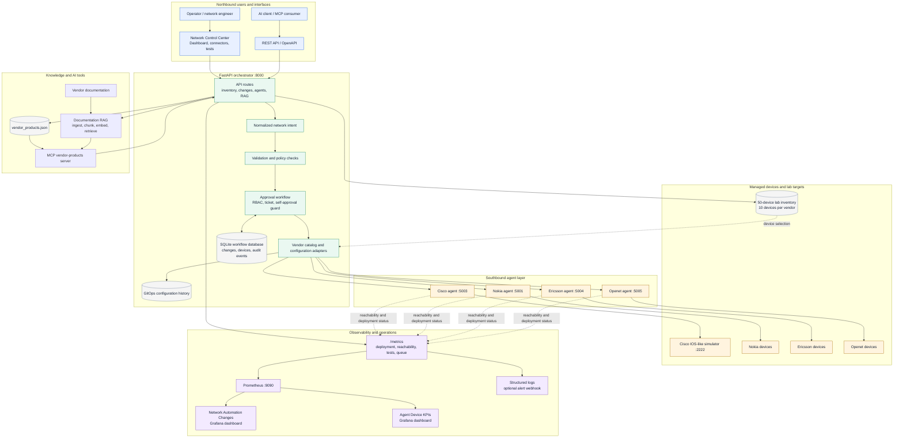
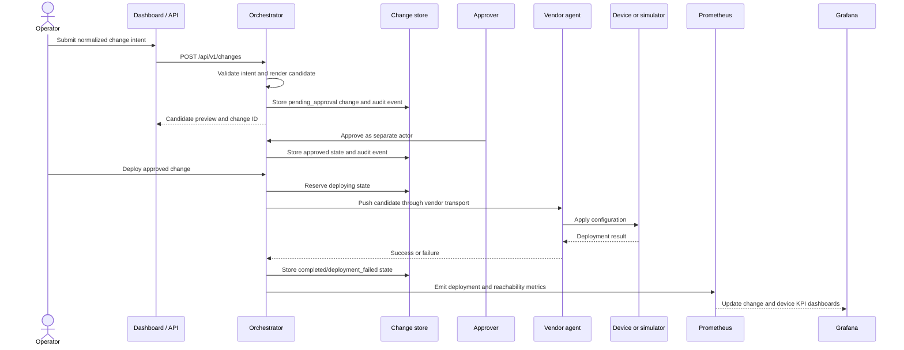

# AI-Based Multi-Vendor Network Configuration Manager

Production-oriented network automation platform for generating, reviewing,
approving, deploying, and observing configuration changes across multi-vendor
network devices.

The repository supports two operating modes:

- **Local lab mode:** Docker Compose, vendor agents, and a Cisco IOS-like
  simulator for safe end-to-end testing.
- **Controlled production mode:** authenticated, approval-gated changes,
  external device inventory, NETCONF deployment, GitOps history, audit events,
  RAG-backed vendor documentation, Prometheus, and Grafana.

## 1. Problem statement

Network configuration is often created manually or with vendor-specific
scripts. This creates several operational problems:

- Network intent and device syntax are disconnected.
- Engineers must remember different CLI, JSON, XML, and YANG formats.
- Changes are difficult to review, approve, audit, and roll back consistently.
- A failed deployment can be hard to correlate with the device, agent, ticket,
  operator, and exact configuration.
- Vendor documentation changes faster than internal runbooks.
- Operations teams need one view of agent reachability, deployment outcomes,
  queue depth, validation failures, and rollback activity.

The goal is to provide a controlled workflow:

```text
Intent -> validation -> vendor rendering -> review -> approval -> deployment
       -> device/agent result -> audit -> metrics, traces, and alerts
```

## 2. Solution overview

The platform converts a normalized northbound intent into vendor-specific
configuration and sends it through a vendor connector. Every production change
is authenticated, persisted, approval-gated, and observable.


```mermaid
flowchart TB
    subgraph Northbound["Northbound users and interfaces"]
        Operator[Operator / network engineer]
        AIClient[AI client / MCP consumer]
        Dashboard["Network Control Center<br/>Dashboard, connectors, tests"]
        APIClient["REST API / OpenAPI"]
        Operator --> Dashboard
        AIClient --> APIClient
    end

    subgraph ControlPlane["FastAPI orchestrator :8000"]
        Routes["API routes<br/>inventory, changes, agents, RAG"]
        Intent["Normalized network intent"]
        Validate["Validation and policy checks"]
        Approval["Approval workflow<br/>RBAC, ticket, self-approval guard"]
        Render["Vendor catalog and configuration adapters"]
        Persist[("SQLite workflow database<br/>changes, devices, audit events")]
        GitOps[(GitOps configuration history)]
        Routes --> Intent --> Validate --> Approval --> Render
        Approval <--> Persist
        Render --> GitOps
    end

    subgraph Southbound["Southbound agent layer"]
        Cisco[Cisco agent :5003]
        Nokia[Nokia agent :5001]
        Ericsson[Ericsson agent :5004]
        Openet[Openet agent :5005]
    end

    subgraph Devices["Managed devices and lab targets"]
        CiscoDevice["Cisco IOS-like simulator :2222"]
        NokiaDevices["Nokia devices"]
        EricssonDevices["Ericsson devices"]
        OpenetDevices["Openet devices"]
        Inventory[("50-device lab inventory<br/>10 devices per vendor")]
    end

    subgraph Knowledge["Knowledge and AI tools"]
        Catalog[(vendor_products.json)]
        RAG["Documentation RAG<br/>ingest, chunk, embed, retrieve"]
        MCP[MCP vendor-products server]
        Docs[Vendor documentation]
        Docs --> RAG
        Catalog --> MCP
        RAG --> MCP
    end

    subgraph Observability["Observability and operations"]
        Metrics["/metrics<br/>deployment, reachability, tests, queue"]
        Prometheus["Prometheus :9090"]
        ChangesDashboard["Network Automation Changes<br/>Grafana dashboard"]
        DeviceDashboard["Agent Device KPIs<br/>Grafana dashboard"]
        Alerts["Structured logs<br/>optional alert webhook"]
        Metrics --> Prometheus
        Prometheus --> ChangesDashboard
        Prometheus --> DeviceDashboard
        Metrics --> Alerts
    end

    Dashboard --> Routes
    APIClient --> Routes
    Routes --> Inventory
    Routes --> Catalog
    Routes --> RAG
    MCP --> Routes
    Render --> Cisco
    Render --> Nokia
    Render --> Ericsson
    Render --> Openet
    Cisco --> CiscoDevice
    Nokia --> NokiaDevices
    Ericsson --> EricssonDevices
    Openet --> OpenetDevices
    Inventory -. device selection .-> Render
    Routes --> Metrics
    Cisco -. reachability and deployment status .-> Metrics
    Nokia -. reachability and deployment status .-> Metrics
    Ericsson -. reachability and deployment status .-> Metrics
    Openet -. reachability and deployment status .-> Metrics

    classDef interface fill:#e8f0ff,stroke:#2864dc,color:#162235
    classDef control fill:#eaf8f1,stroke:#16845b,color:#162235
    classDef southbound fill:#fff4df,stroke:#a86b00,color:#162235
    classDef observability fill:#f3eaff,stroke:#7a4bb3,color:#162235
    classDef storage fill:#f5f5f5,stroke:#718096,color:#162235
    class Operator,AIClient,Dashboard,APIClient interface
    class Routes,Intent,Validate,Approval,Render control
    class Cisco,Nokia,Ericsson,Openet,CiscoDevice,NokiaDevices,EricssonDevices,OpenetDevices southbound
    class Metrics,Prometheus,ChangesDashboard,DeviceDashboard,Alerts observability
    class Persist,GitOps,Inventory,Catalog storage
```

### Completed change execution path

The production change path is approval-gated and produces both an auditable
workflow record and operational telemetry:


```mermaid
sequenceDiagram
    actor Operator
    participant UI as Dashboard / API
    participant API as Orchestrator
    participant DB as Change store
    participant Approver
    participant Agent as Vendor agent
    participant Device as Device or simulator
    participant Prom as Prometheus
    participant Grafana

    Operator->>UI: Submit normalized change intent
    UI->>API: POST /api/v1/changes
    API->>API: Validate intent and render candidate
    API->>DB: Store pending_approval change and audit event
    API-->>UI: Candidate preview and change ID
    Approver->>API: Approve as separate actor
    API->>DB: Store approved state and audit event
    Operator->>API: Deploy approved change
    API->>DB: Reserve deploying state
    API->>Agent: Push candidate through vendor transport
    Agent->>Device: Apply configuration
    Device-->>Agent: Deployment result
    Agent-->>API: Success or failure
    API->>DB: Store completed/deployment_failed state
    API->>Prom: Emit deployment and reachability metrics
    Prom-->>Grafana: Update change and device KPI dashboards
```

## 3. Architecture and components

### Orchestrator

The FastAPI service in `app/` provides:

- Dashboard and static assets.
- Vendor/product catalog APIs.
- Configuration generation.
- Agent registration, reachability probes, and push routing.
- Authenticated production change APIs.
- Device inventory APIs and private-network discovery.
- RAG ingestion and retrieval APIs.
- Health, readiness, trace, and Prometheus-compatible metrics endpoints.

### Vendor catalog and adapters

- `vendor_products.json` stores normalized product metadata, documentation
  links, supported formats, and payload examples.
- `app/core/vendor_catalog.py` loads local or remote catalogs.
- `app/vendor/` contains vendor-specific renderers.
- Supported output formats are CLI, JSON, XML, and YANG where the selected
  product supports them.

### Agent microservices

Dockerized agent services provide vendor-specific southbound integration:

| Agent | Container service | Host port |
|---|---|---:|
| Cisco | `agent_cisco` | 5003 |
| Nokia | `agent_nokia` | 5001 |
| Ericsson | `agent_ericsson` | 5004 |
| Openet | `agent_openet` | 5005 |

The current local Cisco path is:

```text
Dashboard -> orchestrator:8000 -> agent-cisco:5003 -> cisco-simulator:22
```

### Production workflow

`app/core/production.py` implements:

- Typed intent and device models.
- SQLite-backed change records and audit events.
- State transitions: draft, validated, pending approval, approved, deploying,
  completed, deployment failed, rejected, and rolled back.
- Role and permission checks.
- Self-approval prevention.
- Production ticket enforcement.
- Deployment concurrency protection.
- Credential references instead of persisted passwords.

### NETCONF deployment

`app/core/netconf_worker.py` provides a guarded NETCONF implementation with:

- Host-key verification.
- Candidate datastore locking.
- XML validation.
- Candidate validation.
- Confirmed-commit capability checks.
- `commit-confirmed` followed by explicit confirmation.
- Credentials resolved from environment references.

### Documentation RAG

The RAG pipeline in `app/core/rag.py` is:

```text
Vendor documentation
    -> HTTPS importer
    -> HTML/JSON parser
    -> chunking with overlap
    -> deterministic embeddings
    -> SQLite vector store
    -> versioned retrieval with citations
```

The importer rejects private, local, and reserved hosts to reduce SSRF risk.
Retrieval results include source URL, vendor, product, version, and chunk
metadata.

### MCP server

`mcp_server/vendor_products_server.py` exposes MCP tools for:

- `list_vendors_and_products`
- `get_product`
- `get_product_payloads`
- `search_vendor_documentation`

It also exposes the `vendor-products://catalog` resource over stdio.

## 4. Requirements

### Local development

- Windows, Linux, or macOS.
- Python 3.11 or newer.
- Docker Desktop with Compose v2.
- Git.
- At least 4 GB RAM available to Docker.
- Ports available:
  - 8000 orchestrator
  - 5001 Nokia agent
  - 5003 Cisco agent
  - 5004 Ericsson agent
  - 5005 Openet agent
  - 2222 Cisco simulator SSH
  - 9090 Prometheus
  - 3000 Grafana

Python dependencies are pinned or listed in [requirements.txt](requirements.txt).

### Production prerequisites

- External secret management for API keys and device credentials.
- TLS termination and network policy around the API and agents.
- A durable database strategy for workflow records.
- A real queue/worker backend for asynchronous deployment at scale.
- Prometheus and Grafana storage retention policies.
- A controlled alert webhook or incident-management integration.
- Real device inventory and host-key files.

## 5. Quick start with Docker Compose

From the repository root:

```powershell
docker compose up -d --build
```

Check all services:

```powershell
docker compose ps
```

Open:

- Dashboard: [http://localhost:8000/dashboard](http://localhost:8000/dashboard)
- Device discovery: [http://localhost:8000/discovery](http://localhost:8000/discovery)
- API documentation: [http://localhost:8000/docs](http://localhost:8000/docs)
- Agent connectors: [http://localhost:8000/agents](http://localhost:8000/agents)
- MCP catalog: [http://localhost:8000/mcp](http://localhost:8000/mcp)
- Metrics: [http://localhost:8000/metrics](http://localhost:8000/metrics)
- Prometheus: [http://localhost:9090](http://localhost:9090)
- Grafana: [http://localhost:3000](http://localhost:3000)

Default Grafana credentials are `admin` / `admin`. Override them before startup:

```powershell
$env:GRAFANA_ADMIN_USER = "admin"
$env:GRAFANA_ADMIN_PASSWORD = "change-this-password"
docker compose up -d
```

Stop the stack:

```powershell
docker compose down
```

## 6. Dashboard workflow

1. Open the Network Control Center dashboard.
2. Select a vendor and product.
3. Select CLI, JSON, XML, or YANG output.
4. Review the catalog-provided payload template.
5. Enter a change description and edit the payload.
6. Click **Generate candidate**.
7. Review the generated configuration and safety checks.
8. Select a deployment transport.
9. Use **Send to simulator** for local testing.
10. Use the production API workflow for approval-gated deployment.

The dashboard also displays:

- Fleet/control-plane health.
- Change queue depth.
- Successful deployments.
- Validation failures.
- Live agent reachability.
- Agent endpoint and target device.
- Trace correlation status.

### MCP vendor catalog page

Open the [MCP catalog page](http://localhost:8000/mcp) to browse the normalized
vendor catalog used by the MCP server and configuration workflow. Select a
vendor to display **all products** currently available for that vendor, then
select a product to inspect:

- Product metadata and documentation links.
- Supported CLI, JSON, XML, and YANG formats.
- Payload templates for each supported format.
- Indexed vendor documentation citations through the search panel.

The page is backed by these read-only catalog APIs:

- `GET /api/mcp/catalog`: all vendors and their complete product lists.
- `GET /api/mcp/catalog/{vendor}`: every product for one vendor.
- `GET /api/mcp/catalog/{vendor}/{product}`: product metadata.
- `GET /api/mcp/catalog/{vendor}/{product}/payloads`: format templates.
- `POST /api/mcp/documentation/search`: vendor documentation retrieval.

The local MCP server remains available over stdio:

```powershell
python -m mcp_server.vendor_products_server
```

Its `list_vendors_and_products` tool accepts an optional vendor filter, so an
MCP client can request either the complete catalog or all products for one
vendor.

### Network discovery and inventory onboarding

Open the [Device discovery page](http://localhost:8000/discovery) to scan an
approved private, loopback, or link-local CIDR range for reachable devices.
The page checks selected management ports, displays the reachable addresses,
and lets an operator select devices for inventory onboarding.

Discovery is intentionally read-only. It does not configure devices and does
not add results to inventory automatically. The operator must review the
results, provide vendor and product values, and click **Add selected to
inventory**.

The discovery workflow is limited to 256 host addresses per scan and supports
ports such as SSH (`22`), HTTP (`80`), HTTPS (`443`), and NETCONF (`830`):

```text
Approved CIDR -> read-only port probes -> review reachable devices
             -> select devices -> add to inventory
```

The corresponding APIs are:

- `POST /api/inventory/discover`
- `POST /api/inventory/add`
- `GET /api/inventory/summary`

Example discovery request:

```powershell
$body = @{
  cidr = "192.168.1.0/24"
  ports = @(22, 80, 443, 830)
  timeout = 0.35
} | ConvertTo-Json

Invoke-RestMethod http://localhost:8000/api/inventory/discover `
  -Method Post -ContentType "application/json" -Body $body
```

Discovered records use credential references rather than storing passwords.
Production deployments should additionally enforce network authorization,
SSH host-key or TLS certificate verification, external secret management,
scan auditing, and duplicate-device reconciliation before onboarding.

## 7. Production change workflow

Production changes use the authenticated `/api/v1` API:

```text
POST /api/v1/changes
GET  /api/v1/changes/{change_id}
POST /api/v1/changes/{change_id}/approve
POST /api/v1/changes/{change_id}/deploy
POST /api/v1/changes/{change_id}/reject
GET  /api/v1/changes/{change_id}/audit
```

Example:

```json
{
  "device_id": "router-001",
  "vendor": "cisco",
  "product": "ASR 9000",
  "change_type": "interface_update",
  "payload": {
    "interface": "GigabitEthernet0/1",
    "ip": "192.0.2.1",
    "subnet": "24",
    "admin_state": "up"
  },
  "output_format": "cli",
  "reason": "Provision transit link",
  "ticket_id": "CHG-1001",
  "environment": "production",
  "transport": "netconf",
  "requested_by": "engineer@example.com"
}
```

Production changes require a ticket and a different approving actor. Changes
are stored in `configs/network_config_manager.db`. Deployment is disabled by
default:

```powershell
$env:CONFIG_MANAGER_DEPLOYMENT_MODE = "disabled"
```

For controlled simulation:

```powershell
$env:CONFIG_MANAGER_DEPLOYMENT_MODE = "simulated"
docker compose up -d --build
```

### Seed a lab inventory

Create an idempotent lab inventory with at least ten devices for every
supported vendor:

```powershell
python seed_devices.py
```

The default creates 50 records across Cisco, Nokia, Ericsson, Huawei, and
Openet. Device IDs use the `lab-<vendor>-device-01` convention, products are
selected round-robin from the vendor catalog, and management addresses use the
documentation-only `192.0.2.0/24` range. Lab records set
`hostkey_verify=false`; production records must use real pinned host keys.
Only credential environment-variable names are stored.

## 8. Authentication and secrets

Configure API keys before using production mutations:

```powershell
$env:CONFIG_MANAGER_API_KEYS = '{"replace-me":{"actor":"operator@example.com","role":"operator"}}'
```

Supported roles include `operator`, `approver`, `deployer`, and `admin`.
Clients send the key using `X-API-Key`. Device passwords, private keys, and
credential values must not be committed to source control or persisted in
change records.

NETCONF inventory example:

```powershell
$env:DEVICE_INVENTORY_JSON = '{"router-001":{"host":"198.51.100.10","port":830,"username":"netops","password_env":"ROUTER_001_PASSWORD","hostkey_verify":true,"hostkey":"C:\\ProgramData\\network-config-ai\\known_hosts"}}'
$env:ROUTER_001_PASSWORD = "set-outside-source-control"
$env:CONFIG_MANAGER_DEPLOYMENT_MODE = "netconf"
docker compose up -d --build
```

## 9. Cisco simulator and CLI test

The local Cisco simulator is an IOS-like SSH target intended for safe testing:

```powershell
docker compose up -d --build cisco_simulator agent_cisco orchestrator
```

It is exposed on `localhost:2222` with default credentials `admin` / `cisco`.
Override them with `CISCO_SIMULATOR_USERNAME` and
`CISCO_SIMULATOR_PASSWORD`.

Run the complete CLI test:

```powershell
python cli_test.py
```

This checks readiness, generates a Cisco ASR 9000 candidate, pushes it through
the orchestrator and Cisco agent, and validates the simulator response.

Generate without pushing:

```powershell
python cli_test.py --no-push
```

Customize the test:

```powershell
python cli_test.py --interface GigabitEthernet0/3 --ip 192.0.2.20 --subnet 255.255.255.0
```

### RAG-backed current-configuration change test

Run the complete read, index, change, and push workflow:

```powershell
python cisco_rag_change_test.py
```

The script reads `show running-config` through the Cisco agent, stores the
observed configuration in `configs/vendor_knowledge.db` with a
`cisco-simulator://` citation, generates a Cisco ASR 9000 candidate, and pushes
the candidate back through the agent to the simulator. Use `--no-push` to stop
after candidate generation. The simulator retains configuration commands for
the lifetime of its container and exposes them through the agent's
`/current-config` endpoint.

## 10. Testing strategy

### Fast validation

```powershell
python -m compileall -q app mcp_server tests
node --check app/static/dashboard.js
node --check app/static/agents.js
git diff --check
docker compose config --quiet
```

### Focused automated tests

```powershell
python -m pytest -q tests/test_vendor_catalog.py tests/test_observability.py
python -m pytest -q tests/test_production_safety.py tests/test_production_workflow.py
python -m pytest -q tests/test_rag.py
```

### Service smoke tests

```powershell
Invoke-WebRequest http://localhost:8000/health/live -UseBasicParsing
Invoke-WebRequest http://localhost:8000/health/ready -UseBasicParsing
Invoke-WebRequest http://localhost:8000/metrics -UseBasicParsing
Invoke-WebRequest http://localhost:9090/-/ready -UseBasicParsing
Invoke-WebRequest http://localhost:3000/api/health -UseBasicParsing
```

### End-to-end vendor test data

The CLI test validates Cisco. For Grafana test data, use the API to generate
and push cases for each vendor. A local deployment may have only Cisco
hardware simulation; unsupported vendor transports should be recorded as
intentional failures rather than hidden.

## 11. Observability

### Health endpoints

- `GET /health/live`: process liveness.
- `GET /health/ready`: database/application readiness.
- `GET /metrics`: Prometheus-compatible metrics.

Every HTTP response includes `X-Trace-ID`. Clients can provide an existing
`X-Trace-ID` to correlate requests across services.

### Metrics

The orchestrator exposes:

```text
production_change_deployments_total{mode,agent,vendor,device_id,status}
simulated_deployments_total{agent,vendor,device_id,transport,status}
test_cases_total{case,status}
agent_connected_devices{agent,vendor,device_id,status}
configuration_commits_total{vendor,product,status}
device_reachability_total{device_id,status}
config_validation_failures_total{vendor,product}
configuration_rollbacks_total{vendor,status}
configuration_rollback_rate{vendor}
ai_tool_invocations_total{tool}
change_queue_depth
http_requests_total{path,status}
config_manager_http_request_duration_seconds_sum
```

Avoid putting credentials, full configurations, or sensitive payload contents
into metric labels or logs.

### Prometheus

Prometheus is configured in [monitoring/prometheus.yml](monitoring/prometheus.yml)
and scrapes the orchestrator every 15 seconds.

Check the target:

```powershell
$query = [uri]::EscapeDataString('up{job="config-manager"}')
Invoke-WebRequest "http://localhost:9090/api/v1/query?query=$query" -UseBasicParsing
```

### Grafana

The provisioned **Network Automation Changes** dashboard is available at:

[Grafana Network Automation Changes](http://localhost:3000/d/network-automation-changes/network-automation-changes?orgId=1&from=now-24h&to=now&refresh=15s)

It provides:

- Successful and failed change totals.
- Change rates by agent.
- Successful and failed rates by vendor.
- Device totals by agent, vendor, device, transport, and status.

Dashboard provisioning files are under
`monitoring/grafana/provisioning/` and
`monitoring/grafana/dashboards/`.

### Alerting

Failed production changes are emitted as structured logs. Optional webhook
delivery is enabled with:

```powershell
$env:CONFIG_MANAGER_ALERT_WEBHOOK = "https://alerts.example.test/network"
```

Webhook delivery uses a short timeout and cannot mask the original deployment
failure.

### Logs

```powershell
docker compose logs -f orchestrator
docker compose logs -f agent_cisco cisco_simulator
docker compose logs -f prometheus grafana
```

## 12. Vendor documentation RAG

Secured endpoints:

```text
POST /api/v1/knowledge/documents
POST /api/v1/knowledge/search
```

The importer accepts public HTTPS HTML or JSON sources, chunks content, stores
document versions and hashes in `configs/vendor_knowledge.db`, and returns
citations. The MCP server exposes `search_vendor_documentation`.

The default hashed-token embedding is deterministic and dependency-light. For
large-scale semantic retrieval, replace it with a versioned sentence-transformer
or managed embedding service while retaining the citation contract.

## 13. Local MCP vendor server

Run the local MCP server:

```powershell
pip install -r requirements.txt
python -m mcp_server.vendor_products_server
```

Example client configuration:

```json
{
  "mcpServers": {
    "network-config-ai-vendors": {
      "command": "python",
      "args": ["-m", "mcp_server.vendor_products_server"],
      "cwd": "C:/path/to/network-config-ai"
    }
  }
}
```

Set `VENDOR_CATALOG_URL` to load a normalized remote JSON catalog.

## 14. Repository layout

```text
app/
  api/                 FastAPI routes
  core/                workflow, security, NETCONF, RAG, metrics
  static/              dashboard JavaScript and CSS
  templates/           dashboard and agent pages
  vendor/              vendor configuration adapters
agents/                vendor connector services
monitoring/            Prometheus and Grafana provisioning
mcp_server/            local MCP tools and resources
simulator/             local Cisco SSH simulator
configs/               GitOps configs and local SQLite databases
tests/                 focused automated tests
cli_test.py            Cisco end-to-end CLI smoke test
docker-compose.yml     local service topology
```

## 15. Production hardening roadmap

The current implementation provides a production-oriented foundation, but a
real deployment should additionally:

1. Put the API, agents, Prometheus, and Grafana behind TLS and network policy.
2. Replace in-memory metrics with a durable metrics backend, which Prometheus
   provides for time-series retention.
3. Move synchronous deployments to a durable queue and worker model.
4. Use PostgreSQL or another managed database for high availability.
5. Integrate enterprise identity, RBAC, and short-lived credentials.
6. Add policy-as-code checks, maintenance windows, and blast-radius limits.
7. Add high-availability Prometheus/Grafana and backup/restore procedures.
8. Add alert routing, on-call escalation, and SLOs.
9. Test real vendor agents against lab hardware before production rollout.
10. Maintain signed, versioned vendor adapters and documentation sources.

## 16. License and contributors

This project is maintained by Syed Aamir and contributors. Review the
repository license and organizational policies before distributing or
connecting the system to production infrastructure.
